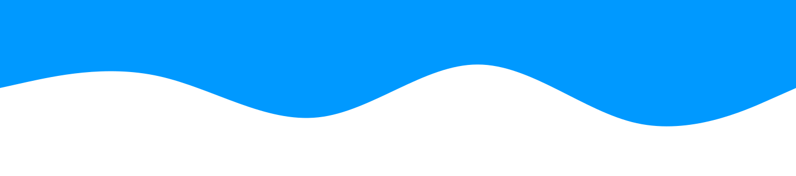

<h2 align="center">:blue_heart: StonksCloud :blue_heart:</h2>

hobby <b>Developer</b> from Germany

 
<h3 align="center"><strong>About me</strong></h3>

  My name is Tim and I am 18 years old. I like to work with programming languages like  Java, VueJS or NodeJS. I like to program software that is helpful for many people.

  
  [:cloud: RyptusCloud](https://github.com/VountyStudios/RyptusCloud) |
  [Templates :computer:](https://studios.vounty.net/templates/)

 
<h3 align="center"><strong>Projects</strong></h3> 

  
  

    <h1> RyptusCloud</h1>
    
RyptusCloud is the first cloud system released by VountyStudios (RyptusMedia at the time). It includes a small API for developers as well as an integrated cloud system. The CloudSystem can be used on any operating system and can communicate with different servers.

  

    
  

    <h1> RunaCloud</h1>
    
The RunaCloud CloudSystem is a somewhat advanced cloud system. It is a complete recode of the old CloudSystem "RyptusCloud". The RunaCloud runs much better than the RyptusCloud and offers more possibilities for developers and users. **Currently in development**

  

    
  

    <h1> HeadStorage</h1>
    
HeadStorage is a real-time search engine for minecraft heads. Search for a name, keyword or an id to find the right head.

    <a href="https://studios.vounty.net/heads/" target="_blank">Website</a>
  

    
  

    <h1> VountyNetwork</h1>
    
VountyNetwork is a Minecraft network based on one of the latest Minecraft versions. VountyNetwork offers games that hardly any or no network had before. The network is only accessible from Minecraft version 1.16.

    <a href="https://vounty.net/" target="_blank">Website</a>
  

    
  

    <h1> Templates</h1>
    
VountyStudios - Templates is a free storage for Discord and TeamSpeak Server layouts. Search or load templates easier then the paste.

    <a href="https://studios.vounty.net/templates/" target="_blank">Website</a>
  

  

<h3 align="center"><strong>Statistics</strong></h3> 
Java</img>
:star: :star: :star: :star: :star:
 
VueJS</img>
:star: :star: :star: :star:
 
NodeJS</img>
:star: :star: :star: :star:
 
PHP</img>
:star: :star: :star:
 
JavaScript</img>
:star: :star: :star:
 
CSS</img>
:star: :star:
 

  

  

2021 &copy; StonksCloud

